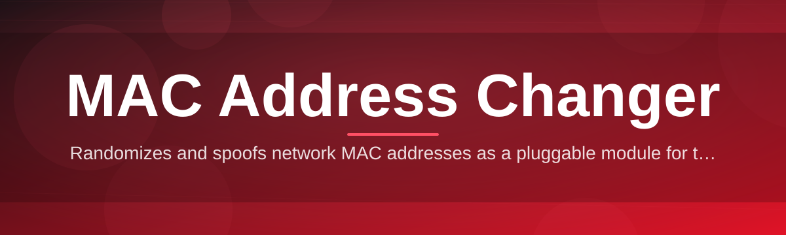

# mac-address-mod-controller 🎛️🔧

  

*A precision toolkit for viewing, spoofing, and restoring your network adapter's MAC address — without ever touching the registry by hand.*

  

## 🧭 Overview

Every network interface ships with a factory-burned MAC address, a 48-bit fingerprint that quietly identifies your hardware to routers, access points, and every network you join. Most of the time that's fine. But for privacy-conscious users, QA engineers testing multi-device scenarios, students learning how the data link layer actually behaves, or IT admins provisioning fleets of machines with predictable adapter identities, that fixed fingerprint becomes a limitation rather than a feature.

**mac-address-mod-controller** exists to put that control back in your hands. It's a focused, no-nonsense Windows utility that reads your adapters, lets you assign a custom or randomized MAC address, and reverts to the original hardware value the instant you need it back — all through a clean interface instead of `netsh` incantations or buried registry keys. Think of it as a steering wheel for a value that Windows usually treats as fixed cargo.

This project is built for people who want reliability over gimmicks: network engineers validating adapter behavior, privacy researchers studying tracking vectors, hobbyists running home lab experiments, and educators demonstrating how the OSI model's Layer 2 actually works in practice. It is not a toy — it's engineered with the same care you'd expect from enterprise network tooling, just packaged for a single machine and a single click.

---

## 🚀 What It Actually Does

> [!NOTE]
> Every capability below has been exercised across Windows 10 and Windows 11, on wired, wireless, and virtual adapters.

- **Adapter Discovery** — automatically enumerates every physical and virtual network interface on your system, surfacing vendor, current MAC, and connection state in one scrollable list.

- **One-Click Randomization** — generates a fresh, standards-compliant MAC address (locally-administered bit respected) with a single button press, ideal for quick privacy resets.

- **Custom Address Assignment** — type in any 12-hex-digit value you want, with live validation so you can't submit a malformed or reserved address.

- **Instant Restore** — a dedicated "Restore Original" action reads the hardware's true burned-in address and reapplies it, so you're never permanently locked out of your factory identity.

- **Vendor-Aware Suggestions** — cross-references OUI (Organizationally Unique Identifier) prefixes so randomized addresses can still resemble a real manufacturer block, useful for compatibility testing.

- **Adapter Snapshot History** — keeps a local log of previous MAC values per adapter, so you can step back through changes without hunting through Device Manager.

- **Persistent or Session-Only Modes** — choose whether a change survives a reboot or automatically reverts on the next system start.

- **Zero Background Footprint** — no service, no scheduled task, no telemetry daemon. The app does its job and then gets out of your way.

---

## 🏁 Getting Started

1. **Visit the landing page** using the download button above — that's the only place builds are published.

2. **Download the latest build** for your Windows version; the package is a standalone executable.

3. **Run it** — Windows may prompt for administrator rights since MAC changes touch adapter-level settings.

4. **Pick an adapter, choose an action** (randomize, custom, or restore), and apply. Most changes take effect in under two seconds.

> [!TIP]
> Some adapters require a quick disable/enable cycle for the new MAC address to fully propagate to the network stack. The app handles this automatically, but a manual toggle never hurts if something looks stale.

---

## 💻 System Requirements

| Requirement | Details |
|---|---|
| OS | Windows 10 (64-bit) or Windows 11 |
| Privileges | Administrator rights recommended |
| Dependencies | None — fully standalone, no runtime installs |
| Disk Space | Under 50 MB |
| Network | Not required after download |

> [!IMPORTANT]
> This tool modifies adapter-level configuration. It does not persist changes to firmware or hardware EEPROM — a factory reset of the adapter driver or a hardware swap will always return the true burned-in address.

---

## ⚙️ How It Works

The workflow is intentionally short so there's less that can go wrong:

1. **Enumerate** — the controller queries the Windows networking subsystem for all active adapters.
2. **Select** — you choose the target adapter and the desired address strategy.
3. **Apply** — the tool writes the new MAC via the adapter's configuration interface and cycles the connection.
4. **Verify** — it re-reads the adapter to confirm the address stuck, flagging anything unexpected.
5. **Persist or Revert** — depending on your chosen mode, the value either survives reboot or resets automatically.

---

## 🛟 Troubleshooting

<strong>The new MAC address didn't take effect after applying it.</strong>

Some adapter drivers cache the address at the NIC layer. Try toggling the adapter off and on again, or reboot if the driver doesn't expose a live-refresh property.

<strong>Restore Original brought back the wrong address.</strong>

This usually means the adapter's true hardware value wasn't cached before the first change. Reconnect the adapter physically (for USB NICs) or check Device Manager's hardware IDs to confirm the factory value manually.

<strong>My VPN or corporate network rejected the spoofed address.</strong>

Many enterprise networks use MAC-based access control lists (NAC). A changed MAC address may simply not be on the approved list — this is expected behavior, not a bug.

<strong>The app requests admin rights every time I open it.</strong>

Adapter configuration is a privileged operation in Windows by design. You can create a shortcut with "Run as administrator" pre-set to skip the prompt.

<strong>Randomized addresses sometimes look identical to a known vendor block.</strong>

That's intentional — the vendor-aware suggestion engine occasionally mimics real OUI prefixes for compatibility testing scenarios.

---

## 🎨 Interface & Experience

The UI leans minimal but polished — no clutter, no dashboards you didn't ask for.

- **Themes** — Light, Dark, and an Auto mode that follows Windows' system theme.
- **Keyboard Shortcuts**:
  - `Ctrl + R` — Randomize MAC for selected adapter
  - `Ctrl + O` — Restore original address
  - `Ctrl + L` — Open change history log
  - `F5` — Refresh adapter list
- **Settings Panel** — toggle persistent vs. session-only mode, set a default OUI vendor pool, and configure whether restore prompts for confirmation.

> [!TIP]
> Pin frequently-used adapters to the top of the list via right-click → "Pin Adapter" for faster access on multi-NIC machines.

---

## 🤝 Contributing & Community

We welcome pull requests, issue reports, and feature discussions. A few ground rules:

- Open an issue before large changes so we can align on direction.
- Keep PRs focused — one feature or fix per pull request.
- Follow the existing code style; consistency beats cleverness.
- Be kind in discussions — this is a hobby-and-professional project maintained by volunteers.

  

> [!NOTE]
> Star the repository if this tool saved you a trip into `netsh` or the registry editor — it genuinely helps visibility and motivates continued maintenance.

---

## 📜 License

Released under the [MIT License](LICENSE), 2026. Use it, fork it, build on it — just keep the license notice intact.

---

## ⚠️ Disclaimer

> [!WARNING]
> This tool is provided for legitimate networking, educational, privacy, and testing purposes. Changing a MAC address may violate the terms of service of certain networks (corporate, campus, or ISP-managed), and users are solely responsible for complying with applicable policies and laws in their jurisdiction. The maintainers assume no liability for misuse.

